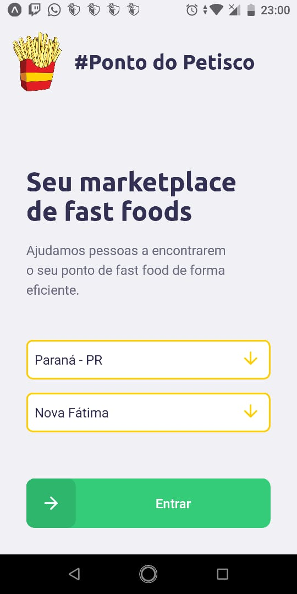
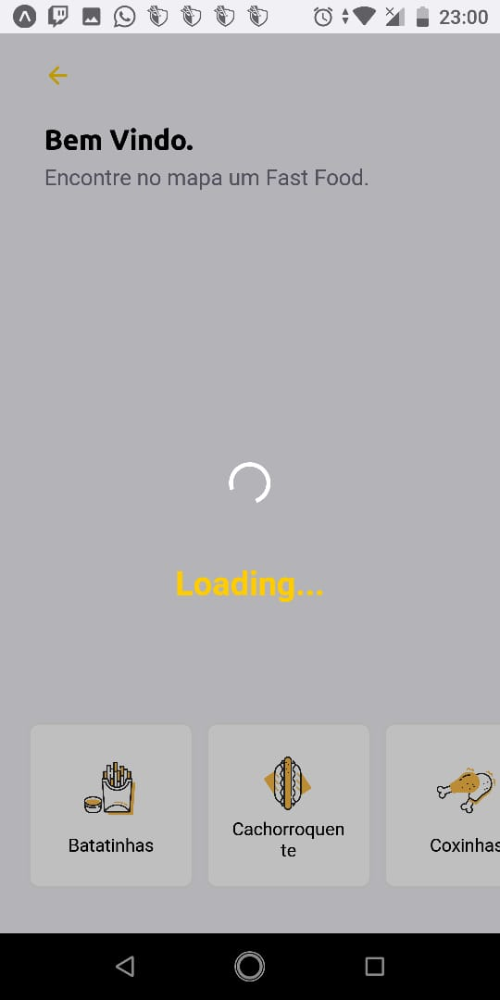
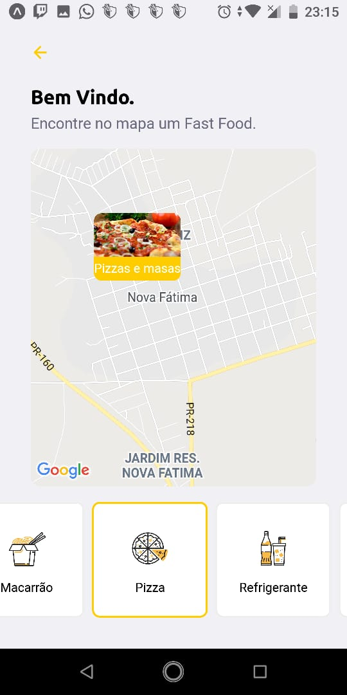
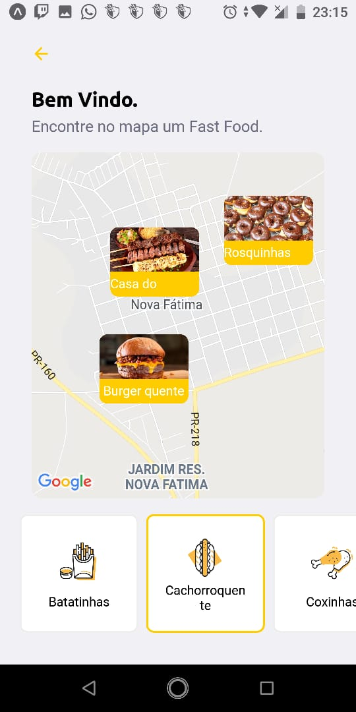
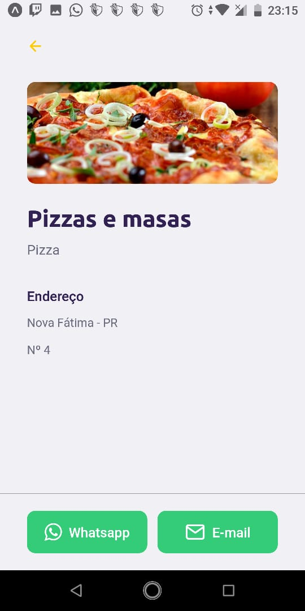
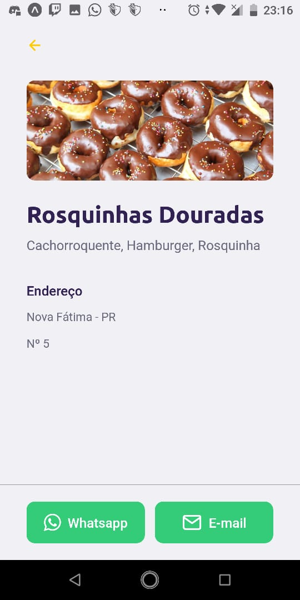
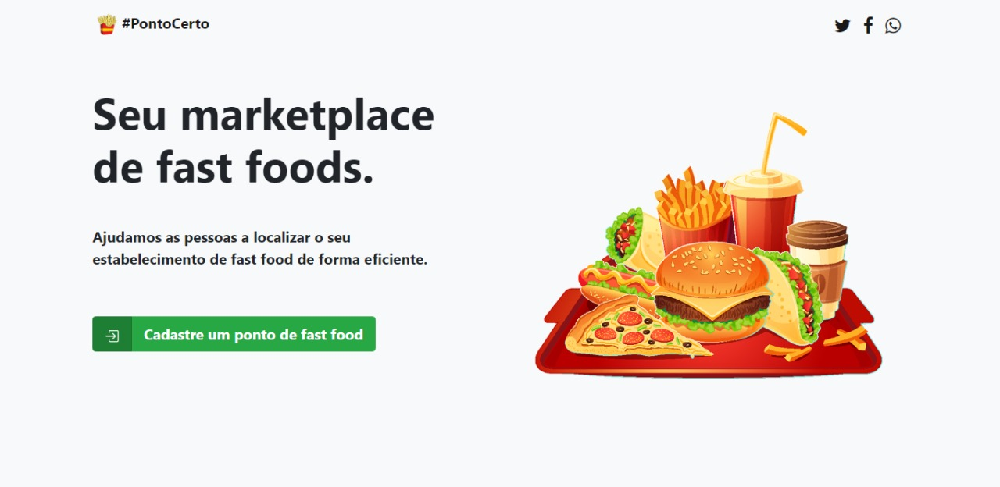
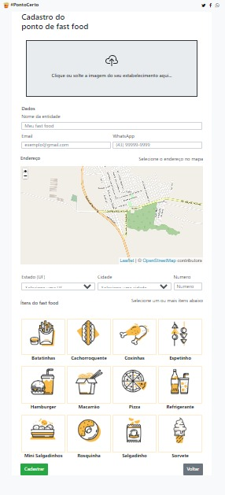
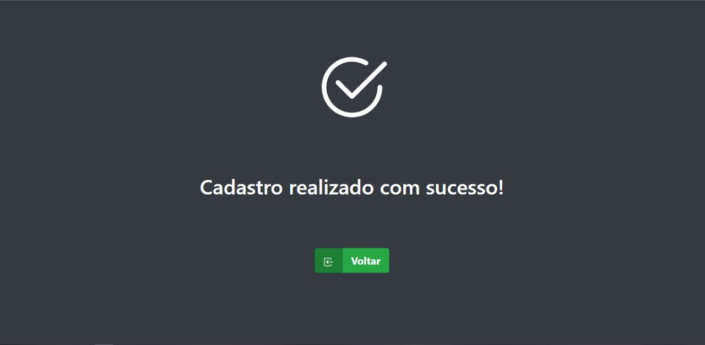

# App_PontoPetisco
 
 Este app foi inspirado no app - [Ecoleta](https://github.com/Rocketseat/nlw-01-booster) desenvolvido durante a semana Next Level Week da Rocketseat.
 
## App Ponto do Petisco

 

 
 
 
 

 
 
 
 

 

## Web Ponto do Petisco

 

 
 
 
 

## Tecnologias

Esse projeto foi desenvolvido com as seguintes tecnologias:

- [Node.js](https://nodejs.org/en/)
- [React](https://reactjs.org)
- [React Native](https://facebook.github.io/react-native/)
- [Expo](https://expo.io/)

## Layout de inspiração.

Você pode visualizar o layout do projeto no formato através [desse link](https://www.figma.com/file/9TlOcj6l7D05fZhU12xWT3/Ecoleta-Booster?node-id=0%3A1). Lembrando que você irá precisar ter uma conta no [Figma](http://figma.com/).

## Licença

Esse projeto está sob a licença MIT. Veja o arquivo [LICENSE](LICENSE.md) para mais detalhes.
